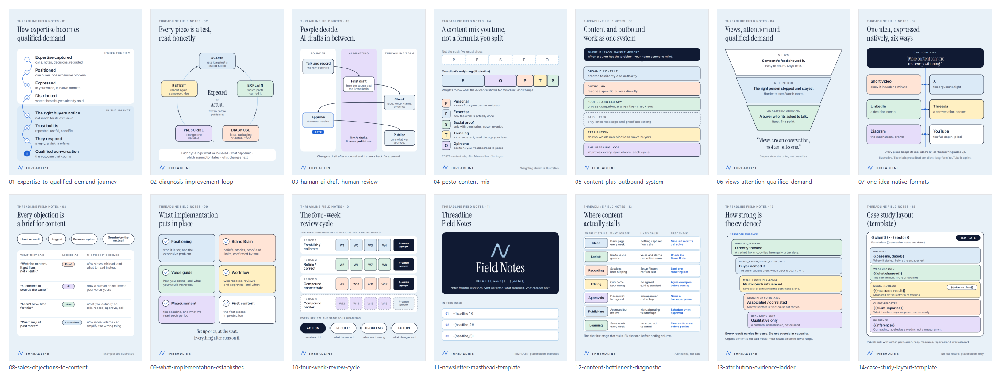

# Newsletter graphics (launch pack, deliverable E)

Fourteen brand-led graphics for the Threadline newsletter, LinkedIn and sales follow-ups, plus a sample newsletter layout. Each graphic uses a different diagram form, so no two read as the same template. Updated 26 September 2026.

**Status of all fourteen: READY FOR OWNER REVIEW.** None is APPROVED, and none has been published or sent. Graphics 11 and 14 are templates with placeholders in `{{double braces}}`.

[Contact sheet (HTML)](contact-sheet.html) · [Sample newsletter layout (HTML)](sample-newsletter-layout.html) · [Sample layout render](sample-newsletter-layout.png)

## Coverage of the two briefs

Two lists asked for ten graphics each. The pack covers both:

| Drive 18A brief (26 Sept 2026) | Graphic |
| --- | --- |
| (1) Masthead / cover | 11 |
| (2) Expertise-to-demand journey | 01 |
| (3) Closed learning loop | 02 |
| (4) Expected-versus-actual analysis | 02 (centre of the loop) |
| (5) Content bottleneck diagnostic | 12 |
| (6) One-source-to-multiple-assets map | 07 |
| (7) Founder / Threadline responsibilities | 03 |
| (8) Four-week review cycle | 10 |
| (9) Attribution evidence ladder | 13 |
| (10) Proof / case-study layout | 14 (template) |
| Sample newsletter layout | `sample-newsletter-layout.html` / `.png` |

The owner's chat brief (launch pack prompt) also asked for PESTO (04), content plus outbound (05), views vs attention vs qualified demand (06), sales objections to content (08) and what implementation establishes (09).

## Rules these follow

- **Brand-led.** No founder name or face, no testimonials, no client results, no pricing, no promised outcomes.
- **Nothing presented as data.**
  - The only proportions (04) and the example objections (08) are labelled *illustrative* on the image.
  - The funnel shapes in 06 carry the note "Shapes show the order, not quantities."
  - 07 says the mix is illustrative and prescribed per client.
  - 12 is labelled "A checklist, not data".
  - 14 contains placeholders only.
- **Four-week periods.** No graphic uses the word "monthly".
  - 10 uses the canonical period names: Period 1 Establish / calibrate, Period 2 Refine / correct, Period 3 Compound / concentrate, Period 4+ Compound harder.
- **Doctrine wording.**
  - Graphics 02, 05 and 10 follow the approved sales-script library (SOP 03, sections I, J and K).
  - 13 uses the five attribution classes from the Master Blueprint and the Living SOP Engine.
  - The root idea in 07 is thesis 2 from the Brand-Led Content Launch Pack V1 (a draft pending founder review).
- **PESTO** (graphic 04): Personal, Expertise, Social proof, Trending and Opinions, as defined by Marcos Ruiz (Vantage) in the transcript the owner supplied.
  - Attributed as "PESTO content mix, after Marcos Ruiz (Vantage)".
  - Shown as an adjustable mix, not an equal split.
- **Vector and code only.** No image generation was used. All text and diagrams are SVG. The Threadline mark is reproduced from `src/components/brand/logo.tsx`, not redrawn.
- **Brand tokens.** Palette from `src/styles/marketing-v9/index.css`; Instrument Serif headings and Inter text; one 3-unit line weight.
- **Legibility.**
  - Body labels are 24–36 px on a 1200 px canvas, so 12–18 px when an email shows the image at 600 px. Small caps eyebrows are 20–22 px.
  - Headlines are 72 px.
  - All exports, the contact sheet and the sample layout were rendered in headless Chrome and inspected.
- **Sample newsletter layout.**
  - A 600 px single-column table layout with inline styles. Everything essential is in the body copy, so it still reads with images off.
  - Placeholders: `{{image_host}}`, `{{cta_url}}`, `{{unsubscribe_url}}`, `{{postal_address}}`, `{{legal_entity_name}}`.
  - It has **not** been inbox-tested in any email client.

## Editing and re-exporting

1. Edit the words or layout in `build.py` (one function per graphic), then run `python build.py`. This rewrites `src/*.svg`, `render/*.html` and `contact-sheet.html`.
2. Run `sh render.sh` to re-export the PNGs and the contact sheet with headless Chrome. Set `CHROME=` if Chrome is not at the default Windows path. Fonts load from Google Fonts, so rendering needs a network connection.
3. The SVGs are self-contained. Each opens directly in a browser or Figma/Illustrator; install Instrument Serif and Inter locally if the editor does not fetch web fonts.

## The graphics

### 01-expertise-to-qualified-demand-journey

- **Diagram form:** Journey
- **Covers:** 18A (2) expertise-to-demand journey
- **Source (editable):** [`src/01-expertise-to-qualified-demand-journey.svg`](src/01-expertise-to-qualified-demand-journey.svg)
- **Exports:** [`export/01-expertise-to-qualified-demand-journey-1200.png`](export/01-expertise-to-qualified-demand-journey-1200.png) (1200 x 1500; web and email, display at 600 px wide) · [`export/01-expertise-to-qualified-demand-journey-1080.png`](export/01-expertise-to-qualified-demand-journey-1080.png) (1080 x 1350; LinkedIn and mobile feeds)
- **Alt text:** A thread runs through eight numbered steps. Inside the firm: 1 expertise captured from calls, notes and decisions; 2 positioned for one buyer and one expensive problem; 3 expressed in the founder's voice in native formats; 4 distributed where those buyers already read. In the market: 5 the right buyers notice; 6 trust builds through repeated, useful, specific pieces; 7 they respond with a reply, a visit or a referral; 8 a qualified conversation, the outcome that counts.
- **Suggested use:** Newsletter opener on what Threadline does; LinkedIn company-page post; the how-it-works section of a sales follow-up email.
- **Status:** READY FOR OWNER REVIEW

### 02-diagnosis-improvement-loop

- **Diagram form:** Loop
- **Covers:** 18A (3) closed learning loop; (4) expected versus actual (centre of the loop)
- **Source (editable):** [`src/02-diagnosis-improvement-loop.svg`](src/02-diagnosis-improvement-loop.svg)
- **Exports:** [`export/02-diagnosis-improvement-loop-1200.png`](export/02-diagnosis-improvement-loop-1200.png) (1200 x 1500; web and email, display at 600 px wide) · [`export/02-diagnosis-improvement-loop-1080.png`](export/02-diagnosis-improvement-loop-1080.png) (1080 x 1350; LinkedIn and mobile feeds)
- **Alt text:** A loop of five stations: Score (rate the piece against a stated rubric), Explain (which parts carried it), Diagnose (idea, packaging or distribution), Prescribe (change one variable), Retest (read it again on the same root idea). At the centre: expected versus actual, with the expectation frozen before publishing. Each cycle logs what we believed, what happened, which assumption failed and what changes next.
- **Suggested use:** Newsletter section on how content is judged; four-week review explainer; the diagnosis step on a sales call (screen-share).
- **Status:** READY FOR OWNER REVIEW

### 03-human-ai-draft-human-review

- **Diagram form:** Swimlane
- **Covers:** 18A (7) founder/Threadline responsibilities
- **Source (editable):** [`src/03-human-ai-draft-human-review.svg`](src/03-human-ai-draft-human-review.svg)
- **Exports:** [`export/03-human-ai-draft-human-review-1200.png`](export/03-human-ai-draft-human-review-1200.png) (1200 x 1500; web and email, display at 600 px wide) · [`export/03-human-ai-draft-human-review-1080.png`](export/03-human-ai-draft-human-review-1080.png) (1080 x 1350; LinkedIn and mobile feeds)
- **Alt text:** Three lanes: founder, AI drafting, Threadline team. The founder talks and records the raw expertise; the AI writes a first draft from that source and the Brand Brain; the Threadline team checks facts, voice, claims and evidence; the founder approves that exact version, which is the gate; the team publishes only what was approved. The AI drafts and never publishes. A draft changed after approval comes back for approval.
- **Suggested use:** Answering the AI objection (newsletter, LinkedIn, sales follow-up); onboarding guide on approvals.
- **Status:** READY FOR OWNER REVIEW

### 04-pesto-content-mix

- **Diagram form:** Proportional bars
- **Covers:** Chat brief only (PESTO)
- **Source (editable):** [`src/04-pesto-content-mix.svg`](src/04-pesto-content-mix.svg)
- **Exports:** [`export/04-pesto-content-mix-1200.png`](export/04-pesto-content-mix-1200.png) (1200 x 1500; web and email, display at 600 px wide) · [`export/04-pesto-content-mix-1080.png`](export/04-pesto-content-mix-1080.png) (1080 x 1350; LinkedIn and mobile feeds)
- **Alt text:** PESTO content mix, after Marcos Ruiz (Vantage): Personal (a story from your own experience), Expertise (how the work is actually done), Social proof (only with permission, never invented), Trending (a current event read through your lens) and Opinions (positions you would defend to peers). A dashed bar of five equal slices is marked 'not the goal'; a second bar shows one client's illustrative weighting, led by expertise and opinions. Weights follow the evidence for each client and change.
- **Suggested use:** Newsletter section on content mix; client onboarding on how the mix is chosen. Keep the 'illustrative' footer tag.
- **Status:** READY FOR OWNER REVIEW

### 05-content-plus-outbound-system

- **Diagram form:** Layered stack
- **Covers:** Chat brief only (content plus outbound)
- **Source (editable):** [`src/05-content-plus-outbound-system.svg`](src/05-content-plus-outbound-system.svg)
- **Exports:** [`export/05-content-plus-outbound-system-1200.png`](export/05-content-plus-outbound-system-1200.png) (1200 x 1500; web and email, display at 600 px wide) · [`export/05-content-plus-outbound-system-1080.png`](export/05-content-plus-outbound-system-1080.png) (1080 x 1350; LinkedIn and mobile feeds)
- **Alt text:** A stack of layers under one destination, market memory: when a buyer has the problem, your name comes to mind. From the top: organic content creates familiarity and authority; outbound reaches specific buyers directly; the profile and content library prove competence when prospects check you; paid, dashed as later, only once message and proof are strong; attribution shows which combinations move buyers; the learning loop improves every layer each cycle.
- **Suggested use:** Newsletter on acquisition; sales call when a prospect asks whether content alone is enough.
- **Status:** READY FOR OWNER REVIEW

### 06-views-attention-qualified-demand

- **Diagram form:** Funnel contrast
- **Covers:** Chat brief only (views vs attention vs qualified demand)
- **Source (editable):** [`src/06-views-attention-qualified-demand.svg`](src/06-views-attention-qualified-demand.svg)
- **Exports:** [`export/06-views-attention-qualified-demand-1200.png`](export/06-views-attention-qualified-demand-1200.png) (1200 x 1500; web and email, display at 600 px wide) · [`export/06-views-attention-qualified-demand-1080.png`](export/06-views-attention-qualified-demand-1080.png) (1080 x 1350; LinkedIn and mobile feeds)
- **Alt text:** Three stacked tiers narrowing downwards. Views: someone's feed showed it; easy to count, says little. Attention: the right person stopped and stayed; harder to see, worth more. Qualified demand: a buyer who fits asked to talk; rare, the point. Beneath: 'Views are an observation, not an outcome.' The shapes show order, not quantities.
- **Suggested use:** LinkedIn post; newsletter on measurement; reply to the 'we got views but no clients' objection.
- **Status:** READY FOR OWNER REVIEW

### 07-one-idea-native-formats

- **Diagram form:** Fan-out
- **Covers:** 18A (6) one-source-to-multiple-assets map
- **Source (editable):** [`src/07-one-idea-native-formats.svg`](src/07-one-idea-native-formats.svg)
- **Exports:** [`export/07-one-idea-native-formats-1200.png`](export/07-one-idea-native-formats-1200.png) (1200 x 1500; web and email, display at 600 px wide) · [`export/07-one-idea-native-formats-1080.png`](export/07-one-idea-native-formats-1080.png) (1080 x 1350; LinkedIn and mobile feeds)
- **Alt text:** One root idea at the top, 'More content can't fix unclear positioning', branches along a single thread into six native formats: a short video that shows it in under a minute, an X post with the argument kept tight, a LinkedIn decision memo, a Threads conversation opener, a diagram of the mechanism, and a YouTube piece with the full depth (a pilot). Every piece keeps its root idea's ID, so the learning adds up. Illustrative: the mix is prescribed per client, and long-form YouTube is a pilot.
- **Suggested use:** Newsletter or LinkedIn post on repurposing, as an illustration of the method. Not a promised scope: the mix is prescribed per client (up to about three channels) and long-form YouTube is a pilot. Do not use it in onboarding as a list of what the client gets.
- **Status:** READY FOR OWNER REVIEW

### 08-sales-objections-to-content

- **Diagram form:** Mapping table
- **Covers:** Chat brief only (objections to content)
- **Source (editable):** [`src/08-sales-objections-to-content.svg`](src/08-sales-objections-to-content.svg)
- **Exports:** [`export/08-sales-objections-to-content-1200.png`](export/08-sales-objections-to-content-1200.png) (1200 x 1500; web and email, display at 600 px wide) · [`export/08-sales-objections-to-content-1080.png`](export/08-sales-objections-to-content-1080.png) (1080 x 1350; LinkedIn and mobile feeds)
- **Alt text:** Flow across the top: heard on a call, logged, becomes a piece, seen before the next call. A table of illustrative examples follows. 'We tried content. It got likes, not clients.' is logged as proof and becomes 'Why views mislead, and what to read instead'. 'AI content all sounds the same.' is logged as AI and becomes 'How a human check keeps your voice yours'. 'I don't have time for this.' is logged as time and becomes 'What you actually do: talk, record, approve, sell'. 'Can't we just post more?' is logged as alternatives and becomes 'Why more volume can amplify the wrong thing'.
- **Suggested use:** Newsletter on sales-to-content; sales call on how call notes feed content. Keep the 'illustrative' footer tag.
- **Status:** READY FOR OWNER REVIEW

### 09-what-implementation-establishes

- **Diagram form:** Checklist blocks
- **Covers:** Chat brief only (what implementation establishes)
- **Source (editable):** [`src/09-what-implementation-establishes.svg`](src/09-what-implementation-establishes.svg)
- **Exports:** [`export/09-what-implementation-establishes-1200.png`](export/09-what-implementation-establishes-1200.png) (1200 x 1500; web and email, display at 600 px wide) · [`export/09-what-implementation-establishes-1080.png`](export/09-what-implementation-establishes-1080.png) (1080 x 1350; LinkedIn and mobile feeds)
- **Alt text:** Six ticked blocks: what implementation establishes. Positioning: who it is for and the expensive problem. Brand Brain: beliefs, stories, proof and limits, confirmed by you. Voice guide: how you sound and what you would never say. Workflow: who records, reviews and approves, and when. Measurement: the baseline and what we read each period. First content: the first pieces in production. Set up once, at the start; everything after runs on it.
- **Suggested use:** Proposal / post-call follow-up explaining implementation; welcome email; newsletter.
- **Status:** READY FOR OWNER REVIEW

### 10-four-week-review-cycle

- **Diagram form:** Calendar / timeline
- **Covers:** 18A (8) four-week review cycle
- **Source (editable):** [`src/10-four-week-review-cycle.svg`](src/10-four-week-review-cycle.svg)
- **Exports:** [`export/10-four-week-review-cycle-1200.png`](export/10-four-week-review-cycle-1200.png) (1200 x 1500; web and email, display at 600 px wide) · [`export/10-four-week-review-cycle-1080.png`](export/10-four-week-review-cycle-1080.png) (1080 x 1350; LinkedIn and mobile feeds)
- **Alt text:** A calendar of four-week periods. Period 1, weeks 1 to 4: establish / calibrate. Period 2, weeks 5 to 8: refine / correct. Period 3, weeks 9 to 12: compound / concentrate. Period 4 onwards, dashed: compound harder. Each period ends in a four-week review. The first engagement is periods 1 to 3, twelve weeks. Every review follows the same four headings: action (what we did), results (what happened), problems (what went wrong) and future (what changes next).
- **Suggested use:** Proposal and post-call follow-up (engagement shape); onboarding guide on the review rhythm.
- **Status:** READY FOR OWNER REVIEW

### 11-newsletter-masthead-template

- **Diagram form:** Masthead / cover
- **Covers:** 18A (1) masthead/cover
- **Source (editable):** [`src/11-newsletter-masthead-template.svg`](src/11-newsletter-masthead-template.svg)
- **Exports:** [`export/11-newsletter-masthead-template-1200.png`](export/11-newsletter-masthead-template-1200.png) (1200 x 1500; web and email, display at 600 px wide) · [`export/11-newsletter-masthead-template-1080.png`](export/11-newsletter-masthead-template-1080.png) (1080 x 1350; LinkedIn and mobile feeds)
- **Alt text:** Newsletter masthead template: a dark panel with the Threadline thread mark, the title 'Field Notes', placeholders for issue number and date, and the line 'Notes from the workshop: what we tested, what happened, what changes next.' Below, an 'In this issue' list with three headline placeholders.
- **Suggested use:** Top of every Field Notes issue. Replace {{issue}}, {{date}} and the three {{headline_n}} placeholders before export, or use the masthead with the list cropped.
- **Status:** READY FOR OWNER REVIEW

### 12-content-bottleneck-diagnostic

- **Diagram form:** Diagnostic grid
- **Covers:** 18A (5) content bottleneck diagnostic
- **Source (editable):** [`src/12-content-bottleneck-diagnostic.svg`](src/12-content-bottleneck-diagnostic.svg)
- **Exports:** [`export/12-content-bottleneck-diagnostic-1200.png`](export/12-content-bottleneck-diagnostic-1200.png) (1200 x 1500; web and email, display at 600 px wide) · [`export/12-content-bottleneck-diagnostic-1080.png`](export/12-content-bottleneck-diagnostic-1080.png) (1080 x 1350; LinkedIn and mobile feeds)
- **Alt text:** A diagnostic grid for where content stalls, with four columns: where it stalls, what you see, the likely cause and the first check. Ideas: blank page every week, nothing captured from calls, mine last month's call notes. Scripts: drafts sound generic, voice and claims not written down, check the Brand Brain. Recording: sessions keep slipping, setup friction and no fixed slot, book one recurring slot. Editing: cuts come back wrong, no agreed editing standard, agree examples before cutting. Approvals: pieces wait for sign-off, one approver and no backup, name a backup approver. Publishing: approved but not live, manual posting falls through, schedule when approved. Learning: same result every week, no expected versus actual, freeze a forecast before posting. Find the first stage that stalls and fix that one before adding volume.
- **Suggested use:** Newsletter on why content stalls; research-call follow-up (value delivery); onboarding when agreeing where the client's process breaks.
- **Status:** READY FOR OWNER REVIEW

### 13-attribution-evidence-ladder

- **Diagram form:** Ladder
- **Covers:** 18A (9) attribution evidence ladder
- **Source (editable):** [`src/13-attribution-evidence-ladder.svg`](src/13-attribution-evidence-ladder.svg)
- **Exports:** [`export/13-attribution-evidence-ladder-1200.png`](export/13-attribution-evidence-ladder-1200.png) (1200 x 1500; web and email, display at 600 px wide) · [`export/13-attribution-evidence-ladder-1080.png`](export/13-attribution-evidence-ladder-1080.png) (1080 x 1350; LinkedIn and mobile feeds)
- **Alt text:** An evidence ladder from strongest to weakest. Directly tracked: a tracked link or code ties the enquiry to the piece. Buyer named it (buyer-named, client-attributed): the buyer told the client which piece brought them. Multi-touch influenced: several pieces touched the path, none alone. Associated or correlated: moved together in time, cause not shown. Qualitative only: a comment or impression, not counted. Every result carries its class; do not overclaim causality. Organic content is not paid media, so most results sit on the lower rungs.
- **Suggested use:** Newsletter on measurement; results/attribution section of onboarding; four-week review explainer.
- **Status:** READY FOR OWNER REVIEW

### 14-case-study-layout-template

- **Diagram form:** Layout template (placeholders only)
- **Covers:** 18A (10) proof/case-study layout
- **Source (editable):** [`src/14-case-study-layout-template.svg`](src/14-case-study-layout-template.svg)
- **Exports:** [`export/14-case-study-layout-template-1200.png`](export/14-case-study-layout-template-1200.png) (1200 x 1500; web and email, display at 600 px wide) · [`export/14-case-study-layout-template-1080.png`](export/14-case-study-layout-template-1080.png) (1080 x 1350; LinkedIn and mobile feeds)
- **Alt text:** A case-study layout template containing placeholders only, marked TEMPLATE: client and sector, permission status and date, then five blocks: baseline (dated, before the engagement), what changed, measured result with its evidence class, client-reported commercial outcome, and inference, labelled as a reading rather than a measurement. Publish only with written permission and keep measured, reported and inferred results apart. It contains no real results.
- **Suggested use:** Internal template for a future, permissioned case study. Never publish with placeholders or invented figures; fill only with a real client's written permission and label each result with its evidence class.
- **Status:** READY FOR OWNER REVIEW
